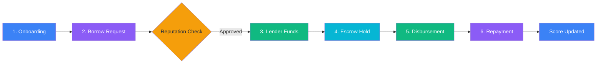

<p align="center">
  
</p>

<h1 align="center">TrustLend</h1>

<p align="center"><em>Reputation is your credit score. Earn trust, unlock capital, and build financial access.</em></p>

<p align="center">
   
   
   
   
   
   
   
</p>

<p align="center">✨ Fast. Transparent. Auditable. Global. ✨</p>

<p align="center">
  <strong><a href="https://trustlendborrow.vercel.app/">Live Production</a></strong> |
  <strong><a href="https://youtu.be/V-SQxunQLow">Video Demo</a></strong> |
  <strong><a href="docs/roadmap.md">Roadmap</a></strong> |
  <strong><a href="docs/getting-started.md">Getting Started Guide</a></strong> |
  <strong><a href="CONTRIBUTING.md">Contributing Guidelines</a></strong>
</p>

---

## 🌍 About The Project

**TrustLend** is a decentralized micro-lending platform built on Stellar and Soroban. It bridges the gap between:
- **Borrowers** in emerging markets who need fast, collateral-free working capital.
- **Lenders** who want transparent yield with measurable social impact.

Traditional lending excludes millions who lack formal credit history or collateral. TrustLend solves this by utilizing **behavior-based on-chain reputation** and contract-enforced lending rules.

### 🏆 What Makes TrustLend Unique?
- **Behavior-Based Reputation:** Replaces legacy collateral-first lending with dynamic on-chain scoring.
- **Escrow-Assisted Disbursement:** Includes revocation window controls to protect lenders.
- **Default Management:** Mitigates risk via insurance-pool mechanics.
- **Gasless Fee Sponsorship:** Removes native XLM friction from user actions so borrowers aren't blocked by network fees.
- **End-to-End Traceability:** Complete transparency through on-chain contract events.

---

## 🚀 Vision: How TrustLend Can Evolve

TrustLend is designed as a foundational layer for decentralized, inclusive credit. As an open-source project, our vision for evolution includes:

1. **Decentralized Credit Oracles:** Evolving the reputation system to aggregate off-chain data (utility bills, mobile money history, Web2 integrations) via trusted oracles.
2. **Cross-Chain Liquidity:** Expanding lender pools to accept stablecoins across various ecosystems, routing them securely through Stellar's high-speed finality layer.
3. **DAO Governance:** Transitioning platform parameters (interest rates, insurance pool fees, slashing mechanics) to a community-governed DAO framework.
4. **Institutional Underwriting:** Enabling institutional liquidity providers to plug proprietary risk models into TrustLend's smart contracts to automatically fund specific borrower profiles.
5. **Global Fiat On/Off Ramps:** Deepening integration with Stellar anchors to allow seamless fiat borrowing and repayment in local currencies worldwide.

*We welcome open-source contributors to help us build this vision! Check out our [Roadmap](docs/roadmap.md) for upcoming milestones.*

---

## 🏗️ Architecture & Workflow

TrustLend uses a practical hybrid architecture: **fast UX off-chain** (Supabase/Next.js) combined with **trust-critical logic on-chain** (Soroban/Stellar). The diagram below maps every component and data flow across all six layers of the platform.

```mermaid
flowchart TB
    %% ── Style definitions ────────────────────────────────────────────────────
    classDef client fill:#3b82f6,color:#fff,stroke:#2563eb,stroke-width:2px
    classDef backend fill:#8b5cf6,color:#fff,stroke:#7c3aed,stroke-width:2px
    classDef automation fill:#f59e0b,color:#1e293b,stroke:#d97706,stroke-width:2px
    classDef chain fill:#10b981,color:#fff,stroke:#059669,stroke-width:2px
    classDef external fill:#64748b,color:#fff,stroke:#475569,stroke-width:2px

    %% ── Client Layer (Blue) ──────────────────────────────────────────────────
    subgraph Client["🖥️ Client Layer"]
        direction TB
        WA[("🌐 Web App<br/>Next.js 16 + React 19")]
        BW[("👛 Stellar Wallet<br/>Freighter / xBull / Albedo<br/>WalletConnect (mobile)")]
        RD[("📱 Role Dashboards<br/>Borrower · Lender · Admin")]
    end

    %% ── Backend Layer (Purple) ──────────────────────────────────────────────
    subgraph Backend["⚙️ Backend Layer (Next.js)"]
        direction TB
        SA[("📡 Server Actions & API Routes<br/>app/actions + app/api")]
        SB[("🗄️ Supabase<br/>PostgreSQL · Auth · RLS · Storage")]
        RM[("🔌 Soroban Client<br/>lib/stellar/soroban.ts")]
        SC[("🔐 Server-side Contract Invoker<br/>lib/stellar/server-contract.ts")]
        RC[("⚡ Redis Cache<br/>Simulation result cache")]
        EM[("📧 Email Service<br/>Resend · Payment notices")]
    end

    %% ── Automation Layer (Amber) ─────────────────────────────────────────────
    subgraph Automation["⏰ Automation Layer (Cron / Vercel)"]
        direction TB
        PD[("📅 Payment-Due Scheduler<br/>lib/scheduler/payment-due.ts<br/>Vercel Cron: hourly")]
        DM[("⚖️ Default Management<br/>lib/scheduler/default-management.ts<br/>Insurance + Mark Defaulted")]
        LK[("🔨 Liquidation Keeper<br/>scripts/liquidation-keeper.ts<br/>Under-collateralization monitor")]
        OC[("📊 Oracle Credit Score Poster<br/>scripts/oracle-post-credit-score.mjs")]
    end

    %% ── Blockchain Layer (Green) ─────────────────────────────────────────────
    subgraph Chain["⛓️ Blockchain Layer (Stellar Soroban)"]
        direction TB
        LP[("💳 Lending Contract<br/>Loans · Repayments · Flash Loans")]
        RP[("⭐ Reputation Contract<br/>Borrower scoring · Tiers · Freeze")]
        ES[("🔒 Escrow Contract<br/>Hold funds · Revocation window")]
        DF[("🛡️ Default Management<br/>Insurance pool · Phases")]
        MS[("🏛️ MultiSigAdmin Contract<br/>N-of-M governance · Admin actions")]
        GV[("🗳️ Governance Contract<br/>Voting · Fee changes · Params")]
        TR[("💰 Treasury Contract<br/>Fee collection · 50/50 distribution")]
        AC[("📈 Auto-Compound Vault<br/>Yield auto-compounding · Harvest")]
    end

    %% ── External / Stellar Layer (Gray) ─────────────────────────────────────
    subgraph External["🌐 External Services & Infrastructure"]
        direction TB
        SR[("🌌 Soroban RPC<br/>soroban-testnet.stellar.org")]
        HZ[("🔭 Horizon API<br/>horizon-testnet.stellar.org")]
        WH[("🔔 Webhook<br/>Payment-due notifications")]
        KP[("🆔 KYC Provider<br/>Document verification")]
        AL[("📣 Alerts<br/>Slack / Discord")]
    end

    %% ── Client → Backend ──────────────────────────────────────────────────
    WA --> SA
    WA --> RD
    BW --> WA

    SA --> SB
    SA --> RM
    SA --> SC

    %% ── Backend → Stellar RPC (Read = simulate, Write = sign+submit) ─────
    RM -->|"simulateContractCall (read)"| SR
    RM -->|"callContract (write)"| SR
    SC -->|"invokeSigned / invokeReadOnly"| SR

    %% ── Backend internal links ───────────────────────────────────────────────
    RM --> RC
    SC --> RC
    SA --> EM
    SA --> WH

    %% ── Automation ───────────────────────────────────────────────────────────
    PD -->|"queries due loans"| SB
    PD --> WH
    DM -->|"queries overdue loans"| SB
    DM --> SC
    DM --> MS
    LK -->|"checks LTV from"| SR
    LK --> SB
    LK --> AL
    OC -->|"posts credit score to"| RP

    %% ── Chain contracts ─────────────────────────────────────────────────
    LP <-->|"loan approval"| ES
    LP <-->|"eligibility check"| RP
    LP <-->|"governance fee changes"| GV
    LP <-->|"admin + multisig gating"| MS
    LP -->|"protocol fees"| TR
    LP <-->|"auto-compound vault"| AC
    DF -->|"insurance payout (multisig-gated)"| MS
    MS -->|"set oracle · whitelist asset · set fee"| RP

    %% ── External ─────────────────────────────────────────────────────────
    SR <-->|"network consensus"| HZ
    BW ---|"Freighter signs tx"| SR
    SB --> KP

    %% ── User labels ──────────────────────────────────────────────────────
    User1(("👤 Borrower"))
    User2(("👤 Lender"))
    User3(("👤 Admin"))

    User1 --> WA
    User2 --> WA
    User3 --> WA
```



### 📖 How to Read the Diagram

| Legend | Meaning |
|---|---|
| ➡️ Solid arrow | Direct function call or data flow |
| 📡 `simulateContractCall` | Read-only Soroban invocation (no fee, no signing) |
| ✍️ `callContract` / `invokeSigned` | State-changing Soroban transaction (requires signing) |
| 🔁 `⇄` Double arrow | Bidirectional contract interaction |

### Core User Flow



1. **Onboarding:** User signs up via Supabase Auth, connects a Stellar wallet (Freighter / xBull / Albedo on desktop, or any WalletConnect v2 mobile wallet such as LOBSTR by scanning a QR code), completes KYC verification, and their on-chain reputation profile is initialized.
2. **Borrowing:** Borrower submits a loan request. The Next.js backend calls `ReputationContract.calculate_max_loan` and `calculate_interest_rate` to determine eligibility and terms.
3. **Lending:** Lender reviews the request in the marketplace, approves it, and the `LendingContract.approve_loan` is called. Funds are locked via `EscrowContract.create_escrow_hold`.
4. **Disbursement:** After the 1-hour revocation window expires, the admin confirms disbursement. `EscrowContract.confirm_disbursement` releases funds to the borrower, and `LendingContract.activate_loan` marks the loan as active.
5. **Repayment:** Borrower repays via the dashboard. The backend calls `LendingContract.record_payment`, which updates the loan balance and emits an event.
6. **Reputation Update:** On-time repayments trigger `ReputationContract.add_reputation_event`, boosting the borrower's tier and unlocking better terms for future loans. Defaults trigger the `DefaultManagement` contract.

### Automation Flows

| Automation | Trigger | Action |
|---|---|---|
| **Payment-Due Scheduler** | Vercel Cron (hourly) | Queries Supabase for loans due within 48h → Sends webhook & email |
| **Default Management** | Vercel Cron (daily) | Checks overdue loans against ledger time → Marks defaulted on-chain → Proposes insurance payout via MultiSigAdmin (requires N-of-M human approval) |
| **Liquidation Keeper** | Manual / cron | Monitors LTV ratios against dynamic thresholds → Liquidates under-collateralized positions → Posts Slack/Discord alerts |
| **Oracle Credit Score** | Manual / cron | Posts verified off-chain credit scores to the Reputation contract |

---

## 🛠️ Tech Stack

| Layer | Technology |
|---|---|
| **Frontend** | Next.js 16, React 19, TypeScript, Tailwind CSS 4, Framer Motion |
| **Backend & DB** | Supabase (Auth, Postgres RLS, Storage) |
| **Blockchain** | Stellar Testnet, Soroban RPC, Horizon API |
| **Wallet** | Freighter Wallet, xBull, Albedo, WalletConnect v2 for mobile wallets (`@creit.tech/stellar-wallets-kit`) |
| **Smart Contracts** | Rust (Soroban, `wasm32v1-none`)  — 8 contracts deployed |
| **Cache** | Upstash Redis |
| **Automation** | Vercel Cron Jobs |
| **Email** | Resend |
| **SEP-24** | Stellar Anchor fiat on/off ramp |

---

## ⚙️ Getting Started (Local Development)

> 📖 **New contributors should start with the [Getting Started Guide](docs/getting-started.md)** for a thorough walkthrough covering Soroban CLI setup, contract compilation, database setup, and the full test suite.

### Quick Start

```bash
git clone https://github.com/thisisouvik/trustlend-stellar.git
cd trustlend-stellar
npm install
cp .env.example .env.local
# Fill in your .env.local values, then:
npm run dev
```

The app will be available at **http://localhost:3000** with hot-reloading enabled.

### Docker (Alternative)
```bash
docker-compose up
```

### Need more detail?
See the [complete setup guide →](docs/getting-started.md)

---

## 🚀 Deploying Contracts to Testnet

One command builds every Soroban contract, deploys it to the Stellar Testnet,
initializes and wires the contracts together, and writes the resulting contract
IDs straight into your `.env.local`:

```bash
npm run deploy:testnet
```

There is no prerequisite step: if the `trustlend-admin` identity does not exist
yet, the CLI creates it and funds it from friendbot before deploying.

Preview the whole run without touching the network or your files:

```bash
npm run deploy:testnet:dry
```

### What it writes

Contract IDs land directly in `.env.local`. Keys already present are updated **in
place** — your Supabase keys, API secrets and comments are left untouched, and a
`.env.local.bak` is taken first. A reference copy also goes to `.env.contracts`.

| Contract | Env key |
| --- | --- |
| Reputation | `NEXT_PUBLIC_REPUTATION_CONTRACT_ID` |
| Escrow | `NEXT_PUBLIC_ESCROW_CONTRACT_ID` |
| Lending | `NEXT_PUBLIC_LENDING_CONTRACT_ID` |
| Default Management | `NEXT_PUBLIC_DEFAULT_CONTRACT_ID` |
| Pooled Lending | `NEXT_PUBLIC_POOLED_LENDING_CONTRACT_ID` |
| Governance | `NEXT_PUBLIC_GOVERNANCE_CONTRACT_ID` |
| MultiSigAdmin | `NEXT_PUBLIC_MULTISIG_ADMIN_CONTRACT_ID` |
| TLEND token / vesting / airdrop | `NEXT_PUBLIC_TLEND_*_CONTRACT_ID` |

### Options

```bash
npm run deploy:testnet -- --help
```

| Flag | Purpose |
| --- | --- |
| `--only lending,escrow` | Deploy a subset (always in dependency order) |
| `--resume` | Reuse IDs from the last run instead of redeploying |
| `--skip-build` | Reuse the WASM already in `contracts/target` |
| `--skip-init` / `--skip-bindings` | Skip initialization / TypeScript bindings |
| `--env-file .env.staging` | Write to a different env file |
| `--network futurenet` | Target another network |
| `--dry-run` | Print every command without executing it |

Contract IDs are recorded to `contracts/.deployments/<network>.json` after each
individual deployment, so a run that fails partway can be picked up with
`--resume` without paying to deploy the same contract twice.

Optional environment overrides: `MULTISIG_SIGNERS`, `MULTISIG_THRESHOLD`,
`ORACLE_ADDRESS`, `TLEND_TOTAL_SUPPLY`, `TLEND_AIRDROP_MERKLE_ROOT`.

> The older `contracts/scripts/deploy.sh` / `deploy.ps1` still work but are
> superseded: the CLI is cross-platform, handles key creation and funding, and
> deploys the pooled-lending contract those scripts omitted.

---

<details>
<summary><b>🧩 Smart Contracts & Deployment Details (Click to Expand)</b></summary>
<br>

**Deployment Credentials:**
- Network: Stellar Testnet
- Admin Address: `GAJRNUO6HSMQG4FNHNWQVRXJZJZ7QRA7HXPYYB6H5PTA3EAAJXJNZD7U`
- Deployment Source Key Alias: `trustlend-admin`

**Contract Registry:**
| Contract | Env Key | Contract ID |
|---|---|---|
| Reputation | `NEXT_PUBLIC_REPUTATION_CONTRACT_ID` | `CD67XYZQ4DDARIXCYP77UR77BW3HWFCMLDHTQ7N6YUDML3NX246DD65G` |
| Escrow | `NEXT_PUBLIC_ESCROW_CONTRACT_ID` | `CABTPZ224ISV65LG5M47CPN3HV4QQKL452PQYWPCBKEQHFG4LSSCSYZO` |
| Lending | `NEXT_PUBLIC_LENDING_CONTRACT_ID` | `CCLVI2JGD7PUV75VHOLTUZF3CVXYBUTOSLKNLHEUUFXOY73BFXUEVEMO` |
| Default Management | `NEXT_PUBLIC_DEFAULT_CONTRACT_ID` | `CCEMBSRCFFRIZLEN54OQVVLSFJBV5QQ3OW5OIIG2BSA33VFJ3NHDYUKG` |
| MultiSigAdmin | `NEXT_PUBLIC_MULTISIG_ADMIN_CONTRACT_ID` | *(set at deployment)* |
| Governance | `NEXT_PUBLIC_GOVERNANCE_CONTRACT_ID` | *(set at deployment)* |
| Treasury | — | *(set at deployment)* |
| Auto-Compound Vault | — | *(set at deployment)* |

TrustLend utilizes the standard Soroban `Contract` class flow for integrations (`simulateTransaction`, `assembleTransaction`, etc.). Check `lib/stellar/soroban.ts` for reference.
</details>

---

## 🔔 Payment Due Webhook Scheduler

TrustLend includes an automated scheduler that checks for loans with payment deadlines approaching within **48 hours** and dispatches webhook notifications to a configured notification service.

### How It Works

1. An external scheduler (Vercel Cron or any HTTP trigger) calls `POST /api/cron/payment-due` hourly.
2. The route queries Supabase for `active` or `funded` loans with `due_at` between now and +48 hours.
3. A POST webhook is sent to `WEBHOOK_NOTIFICATION_URL` for each qualifying loan.
4. The loan's `metadata.payment_due_notified_at` is set to prevent duplicate notifications.
5. Per-loan errors are logged without stopping the rest of the batch.

### Required Environment Variables

| Variable | Description |
|---|---|
| `WEBHOOK_NOTIFICATION_URL` | URL of the notification service that receives payment-due webhook POSTs |
| `CRON_SECRET` | Secret token used to authenticate scheduler requests (`Authorization: Bearer <value>`) |
| `SUPABASE_SERVICE_ROLE_KEY` | Supabase service-role key (required for RLS-bypassing loan queries) |
| `RESEND_API_KEY` | Optional Resend API key for borrower email notifications |
| `RESEND_FROM_EMAIL` | Verified sender address used for TrustLend emails |
| `RESEND_REPLY_TO_EMAIL` | Optional reply-to address for support responses |

When Resend is configured, TrustLend sends borrower emails for loan approval,
loan funding, and overdue payments. Email failures are logged but do not roll
back successful loan state changes.

### Webhook Payload

```json
{
  "borrowerId": "uuid",
  "loanId": "uuid",
  "dueDate": "2026-07-01T12:00:00.000Z",
  "paymentAmount": 800.00
}
```

`paymentAmount` is `principal_amount − repaid_amount` (outstanding balance).

### Triggering the Scheduler

**Vercel Cron (automatic, hourly):** Configured in `vercel.json` — no additional setup needed.

**Manual trigger:**
```bash
curl -X POST https://your-app.vercel.app/api/cron/payment-due \
  -H "Authorization: Bearer $CRON_SECRET"
```

**Local development (no secret set):** The `Authorization` check is skipped when `CRON_SECRET` is not configured.

### Failure Handling

- Individual loan failures are logged and do not block other loans in the same run.
- The scheduler returns a JSON summary: `{ processed, succeeded, failed, errors }`.
- Webhook requests time out after 10 seconds.

---

## 🚦 API Rate Limiting

All public-facing API routes are rate limited to protect backend services from
brute-force attacks, scraping, and misconfigured clients.

### Two layers

| Layer | Scope | Limit | Enforced in |
| --- | --- | --- | --- |
| **Global ceiling** | Every `/api/*` request, keyed by client IP | **100 requests / minute / IP** | [`proxy.ts`](proxy.ts) — before the request reaches a handler |
| **Per-route policy** | One endpoint, keyed by client IP | Stricter, endpoint-specific (e.g. `POST /api/loans/apply` → 5 per 10 min) | `enforceRouteRateLimit()` at the top of each route handler |

The two layers use independent counters, so an expensive endpoint stays tightly
capped even when the caller is well under the global ceiling.

### Exceeding a limit

Requests over the limit are rejected with **HTTP 429** before any database or
Stellar network work is performed:

```http
HTTP/1.1 429 Too Many Requests
Retry-After: 37
X-RateLimit-Limit: 100
X-RateLimit-Remaining: 0
X-RateLimit-Reset: 1735689600000

{ "error": "Too many requests, please slow down." }
```

### Storage backend

Counters are kept in **Upstash Redis** when `UPSTASH_REDIS_REST_URL` and
`UPSTASH_REDIS_REST_TOKEN` are set, so limits hold across serverless instances.
Without them the limiter falls back to a bounded in-memory store (capped at
10,000 buckets with automatic pruning) — per-instance only, and fine for local
development. If Redis is unreachable the limiter **fails open** rather than
blocking legitimate traffic.

### Client IP resolution

The caller is identified from the first present header of
`x-vercel-ip-address` → `cf-connecting-ip` → `x-vercel-forwarded-for` →
`x-real-ip` → `x-forwarded-for` (first hop of the chain). Platform-injected
headers are preferred because a client cannot forge them.

### Bypass

Two escape hatches skip rate limiting entirely — see [`.env.example`](.env.example):

- `Authorization: Bearer <ADMIN_SECRET_KEY>` — trusted internal/admin callers.
- `RATE_LIMIT_WHITELIST` — comma-separated IPs (uptime probes, Prometheus scrapers).

### Adding a policy to a new route

Register the limit in `ROUTE_POLICIES` (or `ROUTE_PATTERN_POLICIES` for dynamic
segments) in [`lib/rate-limit.ts`](lib/rate-limit.ts), then guard the handler:

```ts
export async function POST(request: NextRequest) {
  const rateLimited = await enforceRouteRateLimit(request);
  if (rateLimited) return rateLimited;

  // ...handler logic
}
```

Routes with no explicit policy fall back to **20 requests / minute / IP**.
Scheduler (`/api/cron/*`) and anchor-callback (`/api/webhooks/*`) endpoints are
deliberately left to the global ceiling only — they authenticate with a shared
secret or a verified signature, and a per-route cap could drop legitimate
scheduled runs or provider retries.

---

## 👥 Contributors

Thanks goes to these wonderful people who have contributed to TrustLend:

<a href="https://github.com/thisisouvik/trustlend-stellar/graphs/contributors">
  
</a>

## 🤝 Contributing

We love open-source contributors! Whether you're fixing bugs, improving documentation, or proposing new features, your help is welcome.

Please read our [Contributing Guidelines](CONTRIBUTING.md) and [Code of Conduct](CODE_OF_CONDUCT.md) before submitting a Pull Request.

---

## 🛡️ Security

If you discover a security vulnerability within TrustLend, please refer to our [Security Policy](SECURITY.md) for reporting instructions. Do **not** open a public issue for security-related matters.

---

## 💾 Backups & Disaster Recovery

The PostgreSQL database is dumped, encrypted with AES-256 and uploaded to Amazon S3
every night at 00:00 UTC by the [Automated DB Backup](.github/workflows/db-backup.yml)
workflow. Restore steps, bucket/IAM setup and the quarterly restore drill are
documented in [docs/disaster-recovery.md](docs/disaster-recovery.md).

---

## 📜 License

This project is licensed under the [MIT License](LICENSE).

---

<p align="center">Made with ❤️ by the TrustLend Community.</p>
