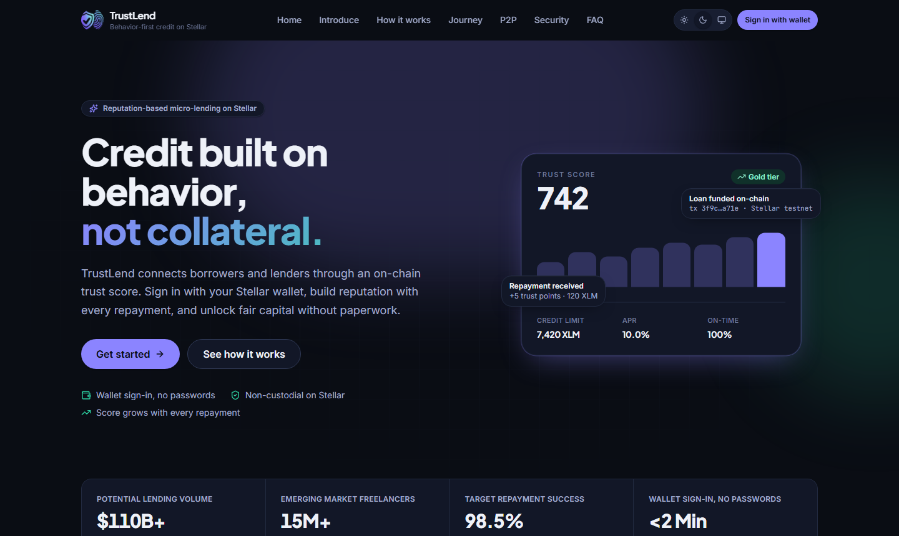
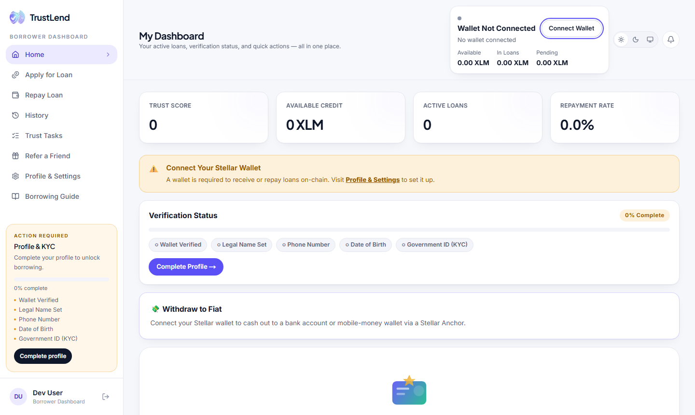
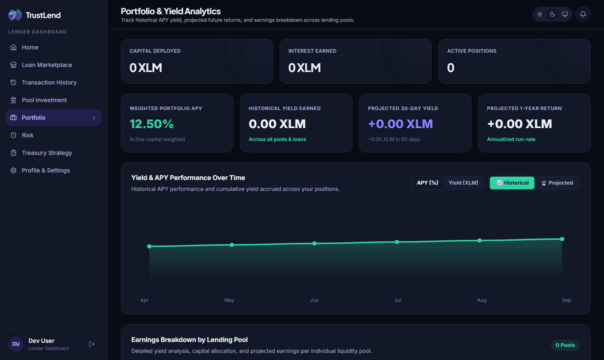
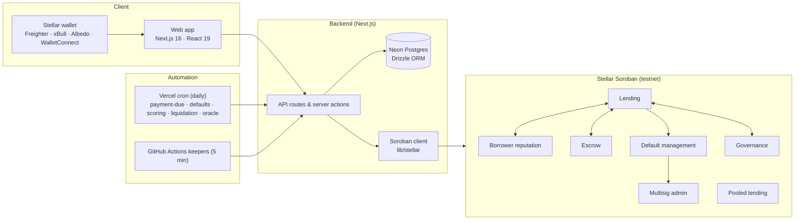

<p align="center">
  
</p>

<h1 align="center">TrustLend</h1>

<p align="center">
  Reputation-based micro-lending on Stellar.<br />
  Borrowers build an on-chain trust score instead of posting collateral; lenders earn transparent yield.
</p>

<p align="center">
  <a href="https://github.com/thisisouvik/trustlend-stellar/actions/workflows/ci.yml"></a>
  <a href="LICENSE"></a>
  
  
  
  
</p>

<p align="center">
  <a href="https://trustlendborrow.vercel.app/"><strong>Live demo</strong></a> ·
  <a href="https://youtu.be/V-SQxunQLow">Video walkthrough</a> ·
  <a href="docs/getting-started.md">Getting started</a> ·
  <a href="docs/roadmap.md">Roadmap</a> ·
  <a href="CONTRIBUTING.md">Contributing</a>
</p>

<p align="center">
  
</p>

---

## What is TrustLend?

Millions of people in emerging markets are locked out of credit because they have no formal credit history and nothing to pledge as collateral. TrustLend replaces collateral with **behaviour**: every on-time repayment raises a borrower's on-chain trust score, which in turn unlocks larger loans and better rates.

- **Borrowers** sign in with a Stellar wallet, complete KYC and request working capital. Eligibility and pricing are computed from their trust score.
- **Lenders** fund individual requests in a marketplace or deposit into pooled lending for passive yield, with every position traceable on-chain.
- **Admins** review KYC, tune risk parameters and approve sensitive actions through an N-of-M multisig.

The protocol runs on a hybrid architecture: **trust-critical logic on Soroban smart contracts** (scoring, escrow, defaults, governance) and a **fast off-chain layer** (Next.js + Neon Postgres) for dashboards, KYC and notifications.

### Highlights

| | |
|---|---|
| **Behaviour-based credit** | Trust score, tiers and credit limits computed from repayment history — no collateral required for reputation loans. |
| **Escrow-assisted disbursement** | Lender funds are held in escrow with a revocation window before release. |
| **Default management & insurance** | Overdue loans are marked on-chain and insurance payouts are proposed through the multisig. |
| **Wallet-native auth** | Sign-In with Stellar (SEP-10). No passwords, no third-party identity provider. |
| **Fiat on/off ramps** | SEP-24 anchor integration for deposits and withdrawals in local currency. |
| **Collateral price oracle** | Median-of-sources XLM/BTC feed with outlier rejection drives the liquidation keeper. |
| **Gasless UX** | Fee sponsorship so borrowers are never blocked by network fees. |

<p align="center">
  
  
</p>

---

## Architecture



**Core loan flow**

1. **Onboard** — the user signs a SEP-10 challenge with their wallet, completes KYC, and a reputation profile is initialised.
2. **Request** — the borrower submits a loan request; the backend reads `calculate_max_loan` / `calculate_interest_rate` from the reputation contract.
3. **Fund** — a lender funds the request; funds are locked via the escrow contract.
4. **Activate** — the lender's payment is verified on Horizon, the lender approves the loan on-chain and the server activates it.
5. **Repay** — the repayment is verified on Horizon and recorded on the contract; on-time payments add reputation events, late ones flow into default management.

See [docs/](docs/) for detailed design notes on each subsystem.

---

## Tech stack

| Layer | Technology |
|---|---|
| Frontend | Next.js 16 (App Router), React 19, TypeScript, Tailwind CSS 4, Framer Motion |
| Backend | Next.js route handlers & server actions, Neon Postgres + Drizzle ORM, Vercel Blob (KYC documents) |
| Auth | Sign-In with Stellar (SEP-10) → signed HttpOnly session cookie (`jose`) |
| Blockchain | Stellar testnet, Soroban RPC, Horizon; `@stellar/stellar-sdk`, `@creit.tech/stellar-wallets-kit` |
| Smart contracts | Rust / Soroban SDK, Cargo workspace in [`contracts/`](contracts/) |
| Infra | Vercel (app + daily cron), GitHub Actions (CI, keepers, backups), Upstash Redis (rate limits, optional), Resend (email, optional) |

---

## Quick start

```bash
git clone https://github.com/thisisouvik/trustlend-stellar.git
cd trustlend-stellar
npm install
cp .env.example .env.local   # fill in DATABASE_URL, SESSION_SECRET, SIWS_SERVER_SECRET
npm run db:migrate           # apply the Drizzle migrations to your Neon database
npm run dev                  # http://localhost:3000
```

Without `DATABASE_URL` the app still boots and renders empty states, which is enough to explore the UI.

The full walkthrough — Rust/Soroban toolchain, building and deploying contracts, running every test suite — is in **[docs/getting-started.md](docs/getting-started.md)**.

### Useful scripts

| Command | What it does |
|---|---|
| `npm run dev` / `npm run build` | Next.js dev server / production build |
| `npm test` · `npm run test:coverage` | Vitest unit tests (660+) |
| `npm run test:e2e` | Playwright end-to-end tests |
| `npm run lint` · `npx tsc --noEmit` | ESLint / type check |
| `npm run db:generate` · `npm run db:migrate` · `npm run db:studio` | Drizzle migrations & browser UI |
| `npm run deploy:testnet` (`:dry`) | Build, deploy and wire every contract to Stellar testnet, writing IDs to `.env.local` |
| `npm run verify:onchain` | Walk the full loan lifecycle against the deployed testnet contracts |
| `cd contracts && cargo test` | Soroban contract tests |

---

## Smart contracts

All contracts live in the [`contracts/`](contracts/) Cargo workspace and are tested, linted (`clippy -D warnings`) and built to WASM in CI.

| Contract | Purpose | Frontend wiring |
|---|---|---|
| `lending` | Loan lifecycle, repayments, flash loans, fees | full lifecycle: request (borrower) → approve (lender) → activate / record_payment (server) |
| `borrower_reputation` | Trust score, tiers, credit limits, freeze | ✅ |
| `escrow` | Hold funds with a revocation window before disbursement | ✅ |
| `default_management` | Mark defaults, insurance pool, payout phases | ✅ |
| `pooled_lending` | Pool deposits auto-matched to borrower requests | pool ids + totals mirrored on every deposit/withdrawal |
| `multisig_admin` | N-of-M approval for privileged actions | ✅ |
| `governance` | Proposals and voting on protocol parameters | ✅ |
| `tlend_token` · `tlend_vesting` · `tlend_airdrop` | Protocol token, vesting schedules, Merkle airdrop | ✅ |
| `referral_rewards` | Pays referral bonuses on first funded loan | linked to `lending` at deploy; typed client |
| `borrower_loyalty` | Loyalty rewards for repeat borrowers | linked to `lending` at deploy; typed client |
| `treasury` | Fee collection and distribution | deployed + typed client |
| `auto_compound_vault` | Auto-compounding yield vault | deployed + typed client |
| `liquidation_auction` | Dutch auction for liquidated collateral | deployed + typed client |
| `usdc_lending_pool` | USDC-denominated pool | deployed + typed client (needs `USDC_TOKEN_ADDRESS`) |
| `zk_credit_verifier` | ZK proof verification for off-chain credit data | deployed + typed client |

Every client-submitted transaction hash is verified against Horizon / Soroban RPC before it is credited, and loans are recorded on the `LendingContract` end to end — see [docs/onchain-lifecycle.md](docs/onchain-lifecycle.md). The last six crates have typed clients in [`lib/contracts/`](lib/contracts/) but no dashboard screens yet; see the [roadmap](docs/roadmap.md).

`npm run deploy:testnet` records the deployed contract IDs locally in `contracts/.deployments/<network>.json` and writes the matching `NEXT_PUBLIC_*_CONTRACT_ID` keys (listed in [`.env.example`](.env.example)) into `.env.local`.

---

## Documentation

| Topic | Document |
|---|---|
| Local setup, toolchain, tests | [docs/getting-started.md](docs/getting-started.md) |
| Authentication (SEP-10) | [docs/auth-siws.md](docs/auth-siws.md) |
| On-chain loan lifecycle & payment verification | [docs/onchain-lifecycle.md](docs/onchain-lifecycle.md) |
| Public API | [docs/api.md](docs/api.md) |
| Rate limiting | [docs/rate-limiting.md](docs/rate-limiting.md) |
| Payment-due notifications & email | [docs/payment-due-scheduler.md](docs/payment-due-scheduler.md) |
| Default management automation | [docs/default-automation.md](docs/default-automation.md) |
| Liquidation keeper | [docs/liquidation-keeper.md](docs/liquidation-keeper.md) |
| Collateral price feeds | [docs/oracle-price-feeds.md](docs/oracle-price-feeds.md) |
| APR / yield formulas | [docs/apr-formulas.md](docs/apr-formulas.md) |
| Fiat on/off ramp (SEP-24) | [docs/sep24-fiat-ramp.md](docs/sep24-fiat-ramp.md) |
| Referral program | [docs/referral-program.md](docs/referral-program.md) |
| Backups & disaster recovery | [docs/disaster-recovery.md](docs/disaster-recovery.md) |
| Formal verification | [docs/formal-verification.md](docs/formal-verification.md) |
| Contract design notes | [docs/contracts/](docs/contracts/) — flash loans, governance, multisig, credit oracle |

---

## Contributing

Contributions are welcome — bug reports, docs, tests, contracts or UI. Please read [CONTRIBUTING.md](CONTRIBUTING.md) for the branch and commit conventions (Conventional Commits are enforced by a commit hook) and the [Code of Conduct](CODE_OF_CONDUCT.md).

Good first stops: the [roadmap](docs/roadmap.md), open issues labelled `good first issue`, and the "contract only" crates above that still need frontend wiring.

## Security

Please do **not** open public issues for vulnerabilities. Follow the disclosure process in [SECURITY.md](SECURITY.md).

## License

[MIT](LICENSE) © TrustLend contributors

<p align="center">
  <a href="https://github.com/thisisouvik/trustlend-stellar/graphs/contributors">
    
  </a>
</p>
